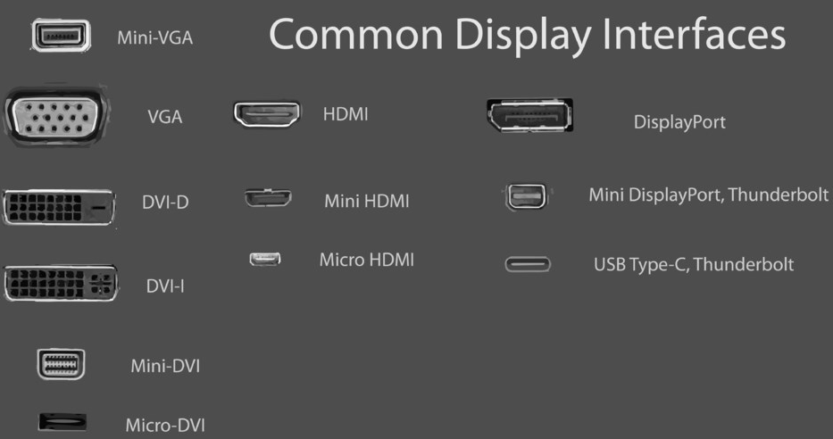
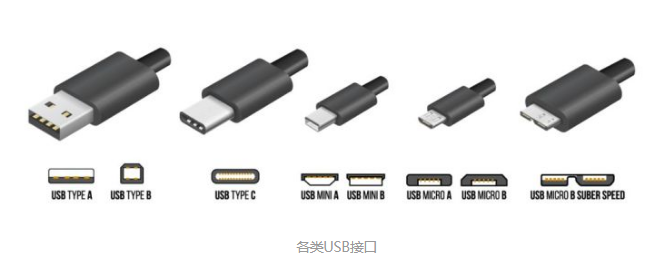
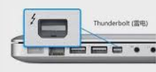
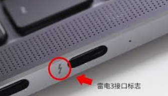
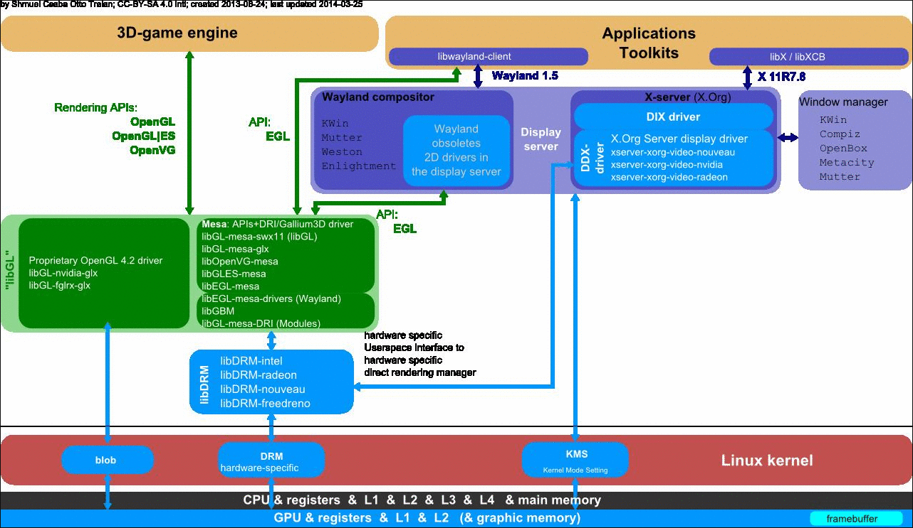

* VGA是比较老的接口是模拟信号，所以一般来说效果比较差，现在主流的显示器用的比较少。

* DVI是数字信号，高分辨率下更加清晰并且失真会更少 。连接DVI的显示器可以到达144hz的刷新率。

* 高画质多媒体接口（英语：High Definition Multimedia Interface，简称HDMI）是一种全数字化影像和声音传送接口，可以传送未压缩的音讯及视频信号。HDMI也是数字信号，是目前最流行的接口，HDMI接口除了有DVI接口的一切优点以外，还有音频功能。连接HDMI2.0的显示器刷新率可以到达240hz

* DisplayPort，简称DP接口，是目前最新的接口，具有前面三类接口的一切优点。目前市面上很多电竞显示器为了达到高刷新率而采用这种接口，因为这种接口可以稳定的达到144hz甚至240hz，但是DP接口目前还没有大规模流行起来，因为成本过高，所以目前只有一些高端显示器才有DP接口。



* USB接口早已被大家所熟知，以往USB接口被设计用来传输数据，所以它在移动硬盘等存储设备的使用上非常常见。现在USB 3.1 Gen2的速度已经达到10Gbps，设计标准也可以满足视频、数据兼顾传输，所以在一些显示器上，也能够发现USB 3.1接口。现在的USB3.1接口，已经能够满足4K 30P的分辨率显示，大致与HDMI1.4在同一水平。但它以后再进行升级，必将能成为最通用的显示传输方式。需要注意的是，USB 3.1 Gen1就是USB 3.0，而USB 3.1 Gen2才是真正的USB3.1。

    USB3.1是传输协议，而USB接口形状有好多种，拿USB 3.1的接口来说，有Type-A、Type-B以及Type-C。Type-C的形状最小，也被宣传的最多。我们所说的Type-C接口，仅仅是接口形状，它并不对等于USB3.1。Type-C接口，也被用在了雷电3上。



* 雷电（thunderbolt）接口的技术融合了PCI Express和DisplayPort（就是上面说的DP口）两种通信协议。其中PCI Express用于数据传输，可以非常方便地进行任何类型设备扩展；DisplayPort用于显示，能同步传输1080p乃至4K视频和最多八声道音频。并且两条通道在传输时都有自己单独的通道，不会产生任何干扰。

    雷电接口到现在已经发展到三代。雷电1的速度达到10Gbps，雷电2的速度达到20Gbps，现在的雷电3达到40Gbps，依然处于民用传输速度的顶端。容易让人混淆的是，雷电接口的形状在雷电1和雷电2外形上采用的是Mini DP的外形，而雷电3采用的是USB Type-C的外形，但即使外形不同，它们采用的数据传输方式都是雷电协议。不像其它接口能直观地从形状就能分辨出来，使用雷电接口需要认准接口旁的闪电标志，以作区分。






LCD是Liquid Crystal Display的简称，即液晶显示器；目前已经取代CRT，成为TV、PC等的标配。液晶屏有RGB TTL、LVDS、MIPI DSI接口，这些接口区别于信号的类型（种类），也区别于信号内容。

　　RGB TTL接口信号类型是TTL电平，信号的内容是RGB666或者RGB888还有行场同步和时钟；

　　LVDS接口信号类型是LVDS信号（低电压差分对），信号的内容是RGB数据还有行场同步和时钟；

　　MIPI DSI接口信号类型是LVDS信号，信号的内容是视频流数据和控制指令。

一、LCD接口以**传递的信号类型**来区分主要有两大类：

```
- 模拟信号: 
   - VGA: Video Graphics Array
- 数字信号
   - TTL: Transistor Transisor Logic
   - LVDS: Low Voltage Differential Signaling
   - TMDS: Transition Minimized Differential Signal
```

* TTL接口，数据传输速率不高，传输距离较短，且抗电磁干扰（EMI）能力也比较差，会对RGB数据造成一定的影响；另外，TTL多路数据信号采用排线的方式来传送，整个排线数量达几十路，不但连接不便，而且不适合超薄化的趋势。接线如下：

    ```
    数据信号: 指RGB数据信号, 如R0~R5、G0~G5、B0~B5
    时钟信号: 像素时钟信号(DCLK), 是传输数据和对数据信号进行读取的基准
    控制信号: 包括数据有效信号(DE), 行同步信号(HSYNC)、场同步信号(VSYNC)
    ```

* LVDS（Low Voltage Differential Signaling）即低压差分信号传输，是一种满足当今高性能数据传输应用的新型技术。由于其可使系统供电电压低至 2V，因此它还能满足未来应用的需要。

    LVDS输出接口利用即低压差分信号传输。采用其输出接口，可以使得信号在差分PCB线或平衡电缆上传输，由于采用低压和低电流驱动方式，因此，实现了低噪声和低功耗。LVDS 输出接口液晶显示器。

    此类LCD目前在中高端平板和笔记本中广泛使用，现在行业出现一种比较新的规范----eDP，在笔记本行业将广泛用于取代LVDS，支持超高分辨率（>1080P）。

* TMDS, 即过渡调制差分信号，也被称为最小化传输差分信号，是一种微分信号机制，运行先进的编码算法，把8bit数据（R、G、B中每路基色信号）通过最小转换编码为10bit数据，这10bit数据包含行场同步信号信息、时钟信息、数据DE、纠错等，经过DC平衡后, 采用差分信号传输数据。它和LVDS、TTL相比有较好的电磁兼容性能，可以用低成本的专用电缆实现长距离、高质量的数据信号传输


​		MIPI （Mobile Industry Processor Interface） 是2003年由ARM， Nokia， ST ，TI等公司成立的一个联盟，目的是把手机内部的接口如摄像头、显示屏接口、射频/基带接口等标准化，从而减少手机设计的复杂程度和增加设计灵活性。

MIPI信号是成对传输的，主要是为了减少干扰，MIPI信号成对走线，两根线从波形看是成反相，所以有外部干扰过来，就会被抵消很大部分。主要用在平板和手机上使用。

​		MIPI接口LCD包括1对差分时钟（CLKP，CLKN），4对数据差分线（D0P，D0N；D1P，D1N；D2P，D2N；D3P，D3N），每一对之间有GND线，4对数据差分线并不一定要全部使用，很多屏只需要2对就可以了；RESET（复位脚），STBYB（高电平有效），VGL，VGH（像素点上开关管的开启关闭电压，加在开关管的栅极上，VGH 高电平打开给像素点电容充电， VGL 负电压 关闭开关管），VCOM（ 液晶像素点的存储电容共用电极），VLED-（背光负极），VLED+（背光正极），电源有1.8V和3.3V。

​		在TFT液晶屏驱动电路供电中，VGH电压和VGL电压担负着开通TFT（薄膜场效应管）对电容充电（修正电容两端电压）和关闭TFT，使电容电压保持（一场周期时间）的作用。因为VGH和VGL的电路比较复杂难调，所以基本屏都已经内置了。

​		MIPI的液晶数据传输中涉及到是DWG（Display Working Group）工作组，该工作组提出了4种液晶规范分别为DCS（Display Command Set）、DBI（Display Bus Interface）、DPI（Display Pixel Interface）、DSI（Display Serial Interface）。DPI接口也可称为RGB接口，DBI接口可称为MCU接口

1. **MIPI DCS（Display Command Set）**

    规范中规定了显示命令设置的一些规范，它并没有说明它具体的硬件连接方式，规定了液晶传输中各个命令的值和意义以及命令说明，主要是为了配合DBI规范、DSI规范来使用的。

2. **MIPI DBI（Display Bus Interface）**

    规范中规定了它的硬件接口方式，它是液晶数据总线接口，可细分为MIPI DBI Type A、MIPI DBI TypeB、MIPI DBI Type C这三种不同的模式，不同模式下的硬件接口以及数据的采样都有所不同，如在MIPI DBI Type A规范中规定是下降沿采样数据值（摩托罗拉6800接口 ），MIPI DBI Type B规范中规定是上升沿采样数据（英特尔8080接口 ）。
    MIPI DBI Type A和MIPI DBI Type B同时又可细分为5种不同数据接口模式，分别为8位数据接口、9位数据接口、16位数据接口、18位数据接口、24位数据接口。不过市面上支持9位数据接口的液晶驱动IC并不多见，当然数据接口越大那么相同一个周期内数据接口越大，所传输的数据越多。而MIPI DBI Type C 只适用于传输于DCS规范中规定的命令和该命令所需要的参数值，不能传输液晶像素的颜色值（虽然DBI规范中规定能传输颜色值，不过市面上的液晶驱动IC是用来传输命令和命令所需的参数值）。
    同样在DBI（Display Bus Interface）规范中规定不同数据接口所支持颜色位数。具体还是要参考所使用的液晶驱动IC资料来确定。
    谈到颜色位数，需要说一下何谓颜色位数，颜色位数也称色彩位数，位图或者视频帧缓冲区中储存1像素的颜色所用的位数,它也称为位/像素(bpp)。色彩深度越高,可用的颜色就越多。市面常用液晶驱动IC支持的颜色位数有16、18、24这三种。

3. **MIPI DPI（Display Pixel Interface）**

    规范中所规定的硬件接口跟DBI规范中并不相同，它不是像DBI规范用Command/Data配置液晶驱动IC的寄存器再进行操作。某种程度上，DPI与DBI的最大差别是DPI的数据线和控制线分离，而DBI是复用的。同样使用DBI接口的液晶很少有大屏幕的，因为需要更多的GRAM从而提高了生产成本，而DPI接口即不需要，因为它是直接写屏，速度快，常用于显示视频或动画用。
    DPI从它的名称中就可以看出它是直接对液晶的各像素点进行操作的，它是利用（H，V）这两个行场信号进行对各像素点进行颜色填充操作。填充速度快，可用于动画显示，目前手机液晶屏所用的接口就是这一类。H（H-SYNC）称为行同步信号；V（V-SYNC）称为场同步信号。它像模拟电视机那样用电子枪那样进行扫频显示，不过它对时序控制要求很高。因此一般的MCU芯片很难支持。

4. **MIPI DSI(Display Serial Interface)**

    符合MIPI协定的串列显示器界面协议，主机与显示器之间用差分信号线连接。
    一对clock信号和1~4对data信号
    一般情况下data0可以配置成双向传输
    一个主机端可以允许同时与多个从属端进行通信


二、其次以**硬件接口连接方式**来区分主要有以下几种模式：

-MCU模式

-RGB模式

-SPI模式

-VSYNC模式

-MDDI模式

-DSI模式

* **MCU模式**

    ​        MCU-LCD接口的标准术语是Intel提出的8080总线标准，因此在很多文档中用I80来指MCU-LCD屏。主要又可以分为8080模式和6800模式，这两者之间主要是时序的区别。数据位传输有8位，9位，16位，18位，24位。连线分为：CS/，RS(寄存器选择）/，RD/，WR/，再就是数据线了。优点是：控制简单方便，无需时钟和同步信号。缺点是：要耗费GRAM，所以难以做到大屏（3.8以上）。对于MCU接口的LCM，其内部的芯片就叫LCD驱动器。主要功能是对主机发过的数据/命令，进行变换，变成每个象素的RGB数据，使之在屏上显示出来。这个过程不需要点、行、帧时钟。MCU接口的LCD的Driver IC都带GRAM，Driver IC作为MCU的一片协处理器，接受MCU发过来的Command/Data，可以相对独立的工作。

* **RGB模式**

    ​		大屏采用较多的模式，数据位传输也有6位，16位和18位，24位之分。连线一般有：VSYNC，HSYNC，DOTCLK，CS，RESET，有的也需要RS，剩下就是数据线。它的优缺点正好和MCU模式相反。

    ​        MCU-LCD屏它与RGB-LCD屏主要区别在于显存的位置。RGB-LCD的显存是由系统内存充当的，因此其大小只受限于系统内存的大小，这样RGB-LCD可以做出较大尺寸，象现在4.3"只能算入门级，而MID中7",10"的屏都开始大量使用。而MCU-LCD的设计之初只要考虑单片机的内存较小，因此都是把显存内置在LCD模块内部.然后软件通过专门显示命令来更新显存，因此MCU屏往往不能做得很大。同时显示更新速度也比RGB-LCD慢。显示数据传输模式也有差别。RGB屏只需显存组织好数据。启动显示后，LCD-DMA会自动把显存中的数据通过RGB接口送到LCM。而MCU屏则需要发送画点的命令来修改MCU内部的RAM（即不能直接写MCU屏的RAM）。所以RGB显示速度明显比MCU快，而且播放视频方面，MCU-LCD也比较慢。

    ​        对于RGB接口的LCM，主机输出的直接是每个象素的RGB数据，不需要进行变换（GAMMA校正等除外），对于这种接口，需要在主机部分有个LCD控制器，以产生RGB数据和点、行、帧同步信号。

    ​        彩色TFT液晶屏主要有2种接口：TTL接口（RGB颜色接口）， LVDS接口（将RGB颜色打包成差分信号传输）。TTL接口主要用于12.1寸一下的小尺寸TFT屏，LVDS接口主要用于8寸以上的大尺寸TFT屏。TTL接口线多，传输距离短；LVDS接口传输距离长，线的数量少。大屏采用较多的模式，控制脚是VSYNC，HSYNC，VDEN，VCLK， S3C2440最高支持24个数据脚，数据脚是VD[23-0]。

    ​        CPU或显卡发出的图像数据是TTL信号（0-5V、0-3.3V、0-2.5V、或0-1.8V），LCD本身接收的也是TTL信号，由于ＴＴＬ信号在高速率的长距离传输时性能不佳，抗干扰能力比较差，后来又提出了多种传输模式，比如LVDS、TDMS、GVIF、P&D、DVI和DFP等。他们实际上只是将CPU或显卡发出的TTL信号编码成各种信号以传输，在LCD那边将接收到的信号进行解码得到ＴＴＬ信号。但是不管采用何种传输模式，本质的TTL信号是一样的。

* **SPI模式**

    采用较少，有3线和4线的，连线为CS/，SLK，SDI，SDO四根线，连线少但是软件控制比较复杂。

* **VSYNC模式**

    该模式其实就是就是在MCU模式上加了一个VSYNC信号，应用于运动画面更新，这样就与上述两个接口有很大的区别。该模式支持直接进行动画显示的功能，它提供了一个对MCU接口最小的改动，实现动画显示的解决方案。在这种模式下，内部的显示操作与外部VSYNC信号同步。可以实现比内部操作更高的速率的动画显示。但由于其操作方式的不同，该模式对速率有一个限制，那就是对内部SRAM的写速率一定要大于显示读内部SRAM的速率。

* **MDDI模式**

    高通公司于2004年提出的接口MDDI，通过减少连线可提高移动电话的可靠性并降低功耗，这将取代SPI模式而成为移动领域的高速串行接口。 连线主要是host_data,host_strobe,client_data,client_strobe,power,GND几根线。

* **DSI模式**

    该模式串行的双向高速命令传输模式，连线有D0P，D0N，D1P，D1N，CLKP，CLKN。 

    

**应用比较多的就是MCU模式和RGB模式，区别有以下几点：**

1. MCU接口：会解码命令，由timing generator产生时序信号，驱动COM和SEG驱器。

    RGB接口：在写LCD register setting时，和MCU接口没有区别。区别只在于图像的写入方式。

2. 用MCU模式时由于数据可以先存到IC内部GRAM后再往屏上写，所以这种模式LCD可以直接接在MEMORY的总线上。

    用RGB模式时就不同了，它没有内部RAM，HSYNC，VSYNC，ENABLE，CS，RESET，RS可以直接接在MEMORY的GPIO口上，用GPIO口来模拟波形.

3. MPU接口方式：显示数据写入DDRAM，常用于静止图片显示。

    RGB接口方式：显示数据不写入DDRAM，直接写屏，速度快，常用于显示视频或动画用。

**MCU接口和RGB接口主要的区别是：**

MCU接口方式：显示数据写入DDRAM，常用于静止图片显示。

RGB接口方式：显示数据不写入DDRAM，直接写屏，速度快，常用于显示视频或动画用。


目前高清显示协议接口有RGB、LVDS、MIPI、eDP、HDMI、miniLVDS、V-by-One等




1）3D-game engine、Applications和Toolkits，应用软件，其中3D-game engine是3D application的一个特例。

2）Display Server

图片给出了两个display server：Wayland compositor和X-Server（X.Org）。X-Server是linux系统在PC时代使用比较广泛的display server，而Wayland compositor则是新设计的，计划在移动时代取代X-Server的一个新的display server。

3）libX/libXCB和libwayland-client

display server提供给Application（或者GUI Toolkits）的、访问server所提供功能的API。libX/libXCB对应X-server，libwayland-client对已Wayland compositor。

4）libGL

libGL是openGL接口的实现，3D application（如这里的3D-game engine）可以直接调用libGL进行3D渲染。

libGL可以是各种不同类型的openGL实现，如openGL（for PC场景）、openGL|ES（for嵌入式场景）、openVG（for Flash、SVG矢量图）。

libGL的实现，既可以是基于软件的，也可以是基于硬件的。其中Mesa 3D是OpenGL的一个开源本的实现，支持3D硬件加速。

5）libDRM和kernel DRM

DRI（Direct Render Infrastructure）的kernel实现，及其library。X-server或者Mesa 3D，可以通过DRI的接口，直接访问底层的图形设备（如GPU等）。

6）KMS（Kernel Mode Set）

一个用于控制显示设备属性的内核driver，如显示分辨率等。直接由X-server控制。


